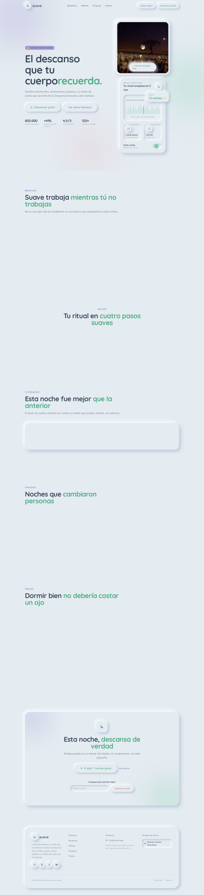

# 🌙 Suave — Landing Page

> **Duerme. Sueña. Flota.** — Landing page de marca para *Suave*, app de bienestar y sueño con estética **neumorfismo (soft-ui)**.

Landing page estática construida con **Astro 7 + Tailwind CSS v4 + TypeScript**, preparada para **Cloudflare Pages**. Serie de 9 landing pages por estilo de diseño (este proyecto: **Neumorfismo**).




---

## 🚀 Producción

| Recurso | URL |
|---|---|
| Producción (Cloudflare Pages) | `https://suave.stevemoya.me` *(cuando conectes el repo)* |
| Preview Pages | `https://landing-suave.pages.dev` |

---

## 🧱 Stack

- **Astro 7** — SSG puro, sin adaptador
- **Tailwind CSS v4** — tokens soft-ui en `src/styles/global.css` (`@theme`)
- **TypeScript 5** estricto
- **@fontsource/quicksand + @fontsource/nunito** auto-hospedadas
- **Vanilla JS** — menú móvil, header scrolled, newsletter — CSP estricta sin `unsafe-eval` ni inline
- **`.node-version` (22.14.0)** + `assetsInlineLimit: 0` + `packageManager` pnpm — fixes CF v3 + CSP de la serie

## 📁 Arquitectura

```
src/
├── components/
│   ├── ui/          → Button (neu-btn, se hunde al pulsar), Card (neu / neu-lg), Badge, Icon, Section, Container
│   ├── layout/      → Header, Navigation, MobileMenu (vanilla JS), Footer
│   ├── sections/    → Hero (mockup sleep-app: olas, sonidos, timer, toggle), Benefits, Method, Progress, Testimonials, Pricing, CTA+Newsletter
│   └── brand/       → Logo (luna neumórfica)
├── data/            → site, benefits, method, progress, plans, testimonials
├── layouts/BaseLayout.astro  → SEO + OG + JSON-LD (SoftwareApplication Health)
├── pages/           → index.astro, 404.astro
├── scripts/         → header, reveal, newsletter
└── styles/global.css → Design System soft-ui: sombra dual extruida + inset + reduce-motion
public/              → _headers (CSP), favicon.svg, robots.txt, og.png
```

## 🎨 Design System (Neumorfismo / Soft-UI)

| Token | Valor | Uso |
|---|---|---|
| `sand` / `surface` | `#E4EBF1` (ambos!) | el neumorfismo exige superficie = fondo |
| `ink` / `ink-soft` | `#3D4B5C` / `#6B7A8C` | texto sobre el relieve |
| `mint` / `coral` / `lilac` / `sky` | pasteles | acentos y datos |
| `--shadow-soft*` | dual | oscura abajo-derecha + clara arriba-izquierda |
| `--shadow-soft-inset*` | invertida | elementos presionados (pressed) |

- Sin bordes: el relieve lo hace la **sombra dual** (7–12px, dos direcciones)
- Botones pill que **se hunden** al pulsar (`inset` + scale)
- Toggle de "Modo noche" neumórfico (track inset + thumb menta)
- Gráfico de olas de sueño con barras neumórficas
- Sombra dble en progress bars (track inset, bar extruida)

## 🛠️ Scripts

```bash
pnpm install
pnpm dev / build / preview / check
```

## ☁️ Deploy en Cloudflare Pages

1. [dash.cloudflare.com](https://dash.cloudflare.com) → **Workers & Pages → Create → Pages → Connect to Git** → repo `landing-suave`.
2. Build: `pnpm build` · Output: `dist` · Node 22+ (`.node-version` ya lo fija).
3. Custom domain → `suave.stevemoya.me`.

> ⚠️ Crearlo como **Pages**, no Worker. Si el build falla con *"error occurred while installing tools or dependencies"*, añade `NODE_VERSION=22.14.0` en Environment variables.

## 🛡️ Seguridad

- CSP estricta (`default-src 'self'`), HSTS, nosniff, frame DENY
- `vite.build.assetsInlineLimit: 0` → scripts siempre externos
- Sin secretos; `.env`/`.dev.vars` ignorados

## 📝 Decisiones

- **100 % CSS-first** + vanilla JS (CSP sin `unsafe-eval`)
- **Datos mock** — marca ficticia de portafolio
- Precios: Brisa $0 · Refugio $6/mes (destacado) · Nido $48/año (−33%)

© 2026 Suave — Proyecto de portafolio de Steve Moya.